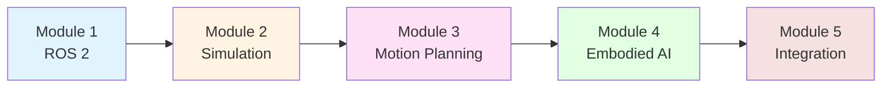

# Physical AI & Humanoid Robotics Hackathon Guide

Welcome to the comprehensive guide for building intelligent humanoid robotic systems! This hands-on educational resource will take you from ROS 2 fundamentals to deploying vision-language-action models on physical robots.

## What You'll Learn

This guide covers the complete stack for modern humanoid robotics development:

🤖 **Module 1: ROS 2 Foundation** - Master the Robot Operating System 2 middleware, URDF modeling, and inter-process communication patterns

🎮 **Module 2: Digital Twin Simulation** - Build realistic robot simulations in Gazebo and Isaac Sim with physics-based sensors

🦾 **Module 3: Motion Planning** - Implement inverse kinematics, trajectory optimization, and collision-free manipulation with MoveIt 2

🧠 **Module 4: Embodied AI** - Integrate computer vision (YOLO), large language models, and reinforcement learning policies

🚀 **Module 5: Integration & Capstone** - Deploy complete systems to edge devices and complete hackathon-style projects

## Who This Guide Is For

**Ideal for**:
- Hackathon participants building robotics projects
- Students in robotics/AI courses (undergraduate/graduate level)
- Developers entering the humanoid robotics field
- Teams prototyping Physical AI applications

**Prerequisites**:
- Python programming (intermediate level)
- Linux command line basics
- Understanding of linear algebra and basic physics
- Familiarity with Git and package managers

## How to Use This Guide

### Learning Path

Each module builds on previous concepts in a structured progression:

### Recommended Timeline

- **Weeks 1-3**: Module 1 (ROS 2 Foundation) - 12 hours
- **Weeks 4-6**: Module 2 (Digital Twin Simulation) - 10 hours
- **Weeks 7-8**: Module 3 (Motion Planning) - 8 hours
- **Weeks 9-10**: Module 4 (Embodied AI) - 10 hours
- **Weeks 11-12**: Module 5 (Integration & Capstone) - 12 hours

**Total**: ~52 hours of hands-on learning

### Hands-On Approach

Every module includes:
- ✅ **Theory chapters** with Mermaid diagrams and code examples
- ✅ **Exercises** with grading rubrics (pass at 70%)
- ✅ **Code examples** ready to run (Python, bash, URDF, SDF)
- ✅ **Capstone projects** demonstrating real-world applications

## Key Technologies

This guide focuses on industry-standard open-source tools:

| Technology | Purpose | Version |
|------------|---------|---------|
| **ROS 2 Humble** | Robot middleware | LTS (May 2027) |
| **Gazebo Garden** | Physics simulation | LTS |
| **NVIDIA Isaac Sim** | GPU-accelerated RL | 2023.1.1 |
| **MoveIt 2** | Motion planning | Humble |
| **Python 3.10+** | Primary language | 3.10+ |
| **Ubuntu 22.04** | Operating system | LTS |

## Hardware Requirements

### Minimum (Simulation Only)
- CPU: 4 cores (Intel i5/AMD Ryzen 5)
- RAM: 8GB
- Storage: 50GB SSD
- GPU: Not required for Gazebo

### Recommended (Full Stack)
- CPU: 8+ cores (Intel i7/AMD Ryzen 7)
- RAM: 16GB+
- Storage: 100GB+ SSD
- GPU: NVIDIA RTX 2060+ (for Isaac Sim and RL training)

### Optional (Physical Robot)
- NVIDIA Jetson Orin Nano (8GB) or Orin NX (16GB) for edge deployment
- RealSense D435i depth camera
- Robot hardware platform (Unitree Go2, custom humanoid, etc.)

## Learning Resources

Throughout the guide, you'll find:

- **[Glossary](./glossary)** - 27+ robotics and AI terms with definitions
- **[Notation Guide](./notation)** - Mathematical symbols and conventions
- **[References](./references)** - 20+ academic papers and documentation sources (APA format)
- **Code Examples** - Functional implementations in `/examples` directory

## Project Philosophy

This guide follows **spec-driven development** principles:

1. **Constitution-Based** - Consistent structure and quality standards
2. **Practical First** - Learn by building, not just theory
3. **Industry Relevant** - Tools and patterns used in production robotics
4. **Open Source** - All code examples permissively licensed

## About the Authors

This educational resource was developed using **SpecKit Plus**, a specification-driven development methodology for creating high-quality technical documentation and educational content.

**Contributors**:
- Architectural design and curriculum structure
- Technical content development
- Code examples and validation
- Exercise design and grading rubrics

## Support and Community

- **GitHub Issues**: Report errors or suggest improvements
- **Office Hours**: Check course platform for schedule
- **Slack/Discord**: Connect with other learners

## License

Educational content: **CC BY-NC-SA 4.0** (attribution, non-commercial, share-alike)
Code examples: **MIT License** (permissive, use in any project)

---

## Ready to Start Learning?

Explore the complete curriculum in the **[Course Guide →](./guide)**

Or jump directly to **[Module 1: ROS 2 Foundation →](./module1/overview)**

---

**Last Updated**: December 2025
**Version**: 1.0.0
