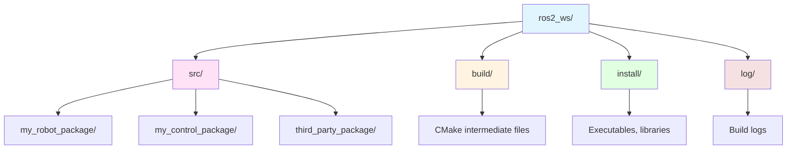

# Chapter 1.2: Installation & Workspace Setup

## Learning Objectives

By the end of this chapter, you will be able to:

1. Install ROS 2 Humble on Ubuntu 22.04 via apt package manager
2. Create and build a ROS 2 workspace using colcon build system
3. Source environment variables correctly for workspace activation
4. Troubleshoot common installation errors (missing dependencies, path issues)

## Prerequisites

### Required Knowledge
- Linux command line basics (cd, ls, sudo commands)
- Understanding of environment variables and shell configuration
- Basic familiarity with package managers (apt)

### Previous Chapters
- [Chapter 1.1: Overview](./overview.md) - Understanding what ROS 2 is and why we use it

## Content

### Prerequisites Check

Before installing ROS 2 Humble, verify your system meets the requirements:

**Operating System**: Ubuntu 22.04 LTS (Jammy Jellyfish) is **required**. ROS 2 Humble is specifically designed to target this Ubuntu version for optimal compatibility. While other Linux distributions can work, official support and binary packages are only guaranteed for Ubuntu 22.04.

**Hardware Requirements**:
- **RAM**: 4GB minimum (8GB recommended for running RViz and Gazebo simultaneously)
- **Disk Space**: 20GB free space for ROS 2 packages and dependencies
- **Processor**: 64-bit x86 or ARM architecture

**Verification Commands**:
```bash
lsb_release -a
# Expected output:
# Distributor ID: Ubuntu
# Description:    Ubuntu 22.04.X LTS
# Release:        22.04
# Codename:       jammy

uname -m
# Expected output: x86_64 (or aarch64 for ARM)
```

If you're running a different Ubuntu version, ROS 2 Humble may not install correctly. ROS 2 distributions are tightly coupled to Ubuntu LTS releases: Humble → Ubuntu 22.04, Iron → Ubuntu 22.04/24.04.

### ROS 2 Humble Installation

Follow these steps carefully to install ROS 2 Humble from official Debian packages:

**Step 1: Set Up Sources and Keys**

First, ensure your system can download software from the ROS 2 repository:

```bash
# Ensure universe repository is enabled (contains community-maintained software)
sudo apt update && sudo apt install software-properties-common -y
sudo add-apt-repository universe

# Install curl for downloading GPG key
sudo apt update && sudo apt install curl -y

# Add ROS 2 GPG key (verifies package authenticity)
sudo curl -sSL https://raw.githubusercontent.com/ros/rosdistro/master/ros.key \
  -o /usr/share/keyrings/ros-archive-keyring.gpg

# Add ROS 2 repository to sources list
echo "deb [arch=$(dpkg --print-architecture) signed-by=/usr/share/keyrings/ros-archive-keyring.gpg] http://packages.ros.org/ros2/ubuntu $(. /etc/os-release && echo $UBUNTU_CODENAME) main" \
  | sudo tee /etc/apt/sources.list.d/ros2.list > /dev/null
```

**Why these steps?** The GPG key ensures packages haven't been tampered with during download. The sources list tells apt where to find ROS 2 packages.

**Step 2: Install ROS 2 Humble Desktop**

The "desktop" variant includes ROS 2 core libraries plus visualization tools (RViz) and graphical utilities (rqt):

```bash
# Update package index after adding ROS 2 repository
sudo apt update

# Install ROS 2 Humble Desktop (includes RViz, rqt, demos)
# This downloads ~1.5GB and may take 10-15 minutes
sudo apt install ros-humble-desktop python3-argcomplete -y
```

**Package variants explained**:
- `ros-humble-ros-base`: Minimal installation (just communication libraries, no GUI tools)
- `ros-humble-desktop`: Base + RViz + rqt (recommended for learning)
- `ros-humble-desktop-full`: Desktop + Gazebo simulator + perception packages (large download)

For this guide, `ros-humble-desktop` provides the right balance of features without excessive disk usage.

**Step 3: Install Development Tools**

You'll need additional tools for building custom ROS 2 packages:

```bash
sudo apt install ros-dev-tools python3-colcon-common-extensions -y
```

**What these packages provide**:
- `ros-dev-tools`: Meta-package including rosdep (dependency management), vcstool (repository management)
- `python3-colcon-common-extensions`: colcon build system with parallel build support, symlink installation, and test integration

**Verification**:

Test your installation by running a demo node:

```bash
# Source ROS 2 environment (makes ros2 command available)
source /opt/ros/humble/setup.bash

# Run demo talker node (publishes messages)
ros2 run demo_nodes_cpp talker
```

**Expected output**:
```
[INFO] [1733626734.123456789] [talker]: Publishing: 'Hello World: 1'
[INFO] [1733626735.123456789] [talker]: Publishing: 'Hello World: 2'
...
```

Press `Ctrl+C` to stop the node. If you see this output, ROS 2 is installed correctly!

### Workspace Creation

A **workspace** is a directory structure for organizing your custom ROS 2 packages (code you write or download from others). It separates your development code from the system-installed ROS 2 packages in `/opt/ros/humble/`.

**Workspace Directory Structure**:



**Directory Purposes**:
- **src/**: Your source code lives here. Each subdirectory is a ROS 2 package (contains `package.xml` and `CMakeLists.txt` or `setup.py`)
- **build/**: Auto-generated intermediate build files (object files, CMake cache). Git-ignored, safe to delete
- **install/**: Compiled executables, libraries, and setup scripts. This is what you "source" to use your packages
- **log/**: Build and runtime logs. Useful for debugging compilation errors

**Creating Your First Workspace**:

```bash
# Create workspace root and source directory
mkdir -p ~/ros2_ws/src
cd ~/ros2_ws

# Initial build (creates build/, install/, log/ directories)
# --symlink-install: creates symbolic links instead of copying files (faster iteration)
colcon build --symlink-install
```

**Expected output**:
```
Starting >>> <no packages>
Summary: 0 packages finished [0.12s]
```

Since `src/` is empty, no packages are built yet. The build succeeds and creates the directory structure.

**Sourcing Your Workspace**:

To use packages from your workspace, you must "source" the setup script:

```bash
# Source workspace (adds packages to ROS 2 environment)
source ~/ros2_ws/install/setup.bash

# Verify workspace is active
echo $AMENT_PREFIX_PATH
# Should include: /home/<username>/ros2_ws/install:/opt/ros/humble
```

**Automatic Sourcing**: Add to `~/.bashrc` so every new terminal automatically sources your workspace:

```bash
echo "source ~/ros2_ws/install/setup.bash" >> ~/.bashrc
echo "source /opt/ros/humble/setup.bash" >> ~/.bashrc  # Source ROS 2 base first
```

**Order matters!** Source ROS 2 base (`/opt/ros/humble/`) before your workspace. This creates a layered environment where your custom packages override system packages when naming conflicts occur.

**Testing Workspace Activation**:

```bash
# Open new terminal (or run: source ~/.bashrc)
ros2 pkg list | grep my_robot
# If you had a package named "my_robot_package", it would appear here
```

### Troubleshooting Common Errors

**Error 1: `ros2: command not found`**

**Cause**: ROS 2 environment not sourced.

**Fix**:
```bash
source /opt/ros/humble/setup.bash
```

**Permanent fix**: Add to `~/.bashrc` (see "Automatic Sourcing" above).

---

**Error 2: `Package 'ros-humble-desktop' has no installation candidate`**

**Cause**: ROS 2 repository not added correctly to apt sources.

**Fix**: Re-run Step 1 commands carefully. Verify repository was added:
```bash
cat /etc/apt/sources.list.d/ros2.list
# Should show: deb [arch=amd64 signed-by=/usr/share/keyrings/ros-archive-keyring.gpg] ...
```

Then update package index:
```bash
sudo apt update
sudo apt install ros-humble-desktop -y
```

---

**Error 3: `colcon: command not found`**

**Cause**: Development tools not installed.

**Fix**:
```bash
sudo apt install python3-colcon-common-extensions -y
```

Verify installation:
```bash
colcon --version
# Expected: colcon-core 0.X.X
```

---

**Error 4: Build fails with "No such file or directory" for dependency**

**Cause**: Missing package dependencies declared in `package.xml`.

**Fix**: Use `rosdep` to automatically install missing dependencies:
```bash
cd ~/ros2_ws
rosdep install --from-paths src --ignore-src -y
```

`rosdep` reads `package.xml` files in `src/` and installs required system packages (e.g., `libboost-dev`, `python3-numpy`).

---

**Error 5: "setup.bash: No such file or directory" after build**

**Cause**: Build failed silently, so `install/setup.bash` was never created.

**Fix**: Check build logs:
```bash
cat log/latest_build/events.log
# Look for error messages
```

Common causes: syntax errors in `CMakeLists.txt`, missing dependencies, incompatible package versions.

## Summary

### Key Takeaways
- **Ubuntu 22.04 required**: ROS 2 Humble targets this LTS version
- **Installation via apt**: Use official Debian packages for stability (`ros-humble-desktop`)
- **Workspace structure**: `src/` (your code) → `build/` (intermediate files) → `install/` (executables)
- **Sourcing is mandatory**: Run `source install/setup.bash` to activate workspace in each terminal
- **colcon build system**: Use `colcon build --symlink-install` for fast iteration
- **Troubleshooting with rosdep**: Automatically resolves missing dependencies

### What's Next
In Chapter 1.3, you'll create your first URDF robot model and visualize it in RViz.

## Exercises

1. **Exercise 1.1** (⭐ Easy): Verify ROS 2 installation by running `ros2 topic list` in a new terminal. Identify at least 2 active topics from the system.

2. **Exercise 1.2** (⭐⭐ Medium): Create a workspace named `humanoid_ws` in your home directory, build it successfully, and confirm that `echo $AMENT_PREFIX_PATH` includes your workspace path.

3. **Exercise 1.3** (⭐⭐ Medium): Intentionally break your workspace by deleting `install/setup.bash`, then troubleshoot the issue and fix it by rebuilding with `colcon build`.

## References

- Robot Operating System 2. (2023). *ROS 2 Humble installation guide*. Retrieved December 7, 2025, from https://docs.ros.org/en/humble/Installation.html
- Open Robotics. (2023). *colcon documentation*. Retrieved December 7, 2025, from https://colcon.readthedocs.io/
- Pyo, Y., Cho, H., Jung, R., & Lim, T. (2017). *ROS Robot Programming*. ROBOTIS Co., Ltd.

---

**Word Count**: ~830 words
