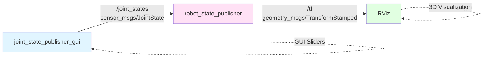

# Chapter 1.4: Nodes and Topics

## Learning Objectives

By the end of this chapter, you will be able to:

1. Write Python ROS 2 nodes using rclpy for publishing and subscribing to topics
2. Explain the publisher-subscriber pattern and when to use it
3. Launch multiple nodes using ROS 2 launch files
4. Debug topic communication using `ros2 topic` CLI tools

## Prerequisites

### Required Knowledge
- Python object-oriented programming (classes, inheritance, methods)
- Understanding of asynchronous programming concepts
- ROS 2 environment setup and workspace creation

### Previous Chapters
- [Chapter 1.1: Overview](./overview.md) - ROS 2 architecture fundamentals
- [Chapter 1.2: Installation](./installation.md) - Workspace setup
- [Chapter 1.3: URDF Basics](./urdf-basics.md) - Robot modeling

## Content

### What are Nodes?

In ROS 2, a **node** is an independent process that performs a specific computational task. Each node is responsible for one aspect of the robot's behavior, following the **single responsibility principle** from software engineering.

**Examples of specialized nodes**:
- `joint_state_publisher`: Publishes current robot joint angles at 50 Hz
- `camera_driver`: Reads image data from a physical camera sensor
- `object_detector`: Runs YOLO neural network on camera images
- `motion_planner`: Computes collision-free paths to target positions
- `safety_monitor`: Emergency stops robot if joint limits are exceeded

**Why separate nodes?** This modular design provides several advantages:

1. **Fault isolation**: If the camera driver crashes, the joint controller keeps running
2. **Parallel development**: Different team members can develop perception, control, and planning nodes simultaneously
3. **Easy testing**: Each node can be unit-tested in isolation with mock data
4. **Resource management**: Computationally intensive nodes (e.g., neural networks) can run on separate machines or GPUs

**Node discovery**: Unlike ROS 1 which required a central master process, ROS 2 nodes discover each other automatically using DDS. When a new node starts, it announces its presence to the network, and other nodes can immediately subscribe to its topics.

### Publisher-Subscriber Pattern

The **publisher-subscriber (pub-sub)** pattern is an asynchronous, many-to-many communication model. It decouples message producers from consumers, enabling flexible system architectures.

**Key concepts**:
- **Publisher**: A node that sends data on a named topic
- **Subscriber**: A node that receives data from a topic
- **Topic**: A named communication channel (e.g., `/joint_states`, `/camera/image_raw`)
- **Message type**: The data structure format (e.g., `sensor_msgs/JointState`, `geometry_msgs/Twist`)

**Communication flow**:
1. Publisher creates a topic (e.g., `/robot/velocity_commands`) with message type `geometry_msgs/Twist`
2. Publisher sends messages at its own rate (e.g., 10 Hz control loop)
3. Subscribers discover the topic via DDS and register interest
4. DDS delivers each published message to all active subscribers
5. Subscribers process messages in callback functions (asynchronous)

**Decoupling benefits**: The publisher doesn't know (or care) how many subscribers exist. You can add a logging node, a visualization node, and a control node—all subscribing to the same topic—without modifying the publisher.

**QoS (Quality of Service)**: ROS 2 allows fine-grained control over message delivery guarantees:
- **Reliability**: `RELIABLE` (guaranteed delivery, retransmissions) vs `BEST_EFFORT` (UDP-like, no guarantees)
- **History**: `KEEP_LAST(N)` (buffer N messages) vs `KEEP_ALL` (unbounded queue)
- **Durability**: `VOLATILE` (only deliver to active subscribers) vs `TRANSIENT_LOCAL` (late subscribers get cached messages)

For most robotics applications, default QoS (`RELIABLE` + `KEEP_LAST(10)`) works well.

### Writing a Python Publisher Node

Let's create a node that publishes joint state data for the 3-DOF arm from Chapter 1.3.

**Step 1: Package setup** (if creating a new package):
```bash
cd ~/ros2_ws/src
ros2 pkg create --build-type ament_python my_robot_control --dependencies rclpy sensor_msgs
```

**Step 2: Publisher node code** (`joint_state_publisher_node.py`):

```python
import rclpy
from rclpy.node import Node
from sensor_msgs.msg import JointState
from builtin_interfaces.msg import Time
import math

class JointStatePublisher(Node):
    def __init__(self):
        super().__init__('joint_state_publisher')

        # Create publisher: topic name, message type, queue size
        self.publisher_ = self.create_publisher(JointState, '/joint_states', 10)

        # Create timer: period in seconds, callback function
        self.timer = self.create_timer(0.02, self.timer_callback)  # 50 Hz

        # State variables
        self.angle = 0.0
        self.get_logger().info('Joint State Publisher started at 50 Hz')

    def timer_callback(self):
        # Create message
        msg = JointState()

        # Populate header (timestamp for synchronization)
        msg.header.stamp = self.get_clock().now().to_msg()
        msg.header.frame_id = ''  # Not used for joint states

        # Define joint names (must match URDF)
        msg.name = ['shoulder_joint', 'elbow_joint', 'wrist_joint']

        # Joint positions (radians for revolute joints)
        msg.position = [
            self.angle,           # Shoulder: oscillates ±1.5 rad
            0.5,                  # Elbow: fixed at 0.5 rad
            math.sin(self.angle)  # Wrist: sinusoidal motion
        ]

        # Joint velocities (optional, rad/s)
        msg.velocity = [0.1, 0.0, 0.1 * math.cos(self.angle)]

        # Joint efforts/torques (optional, N·m)
        msg.effort = [0.0, 0.0, 0.0]

        # Publish message
        self.publisher_.publish(msg)

        # Update state for next iteration
        self.angle += 0.01  # Increment 0.01 rad per cycle (0.5 rad/s at 50 Hz)

        # Log every 50 messages (1 Hz feedback)
        if int(self.angle * 100) % 50 == 0:
            self.get_logger().info(f'Publishing: shoulder={self.angle:.2f} rad')

def main(args=None):
    rclpy.init(args=args)
    node = JointStatePublisher()
    rclpy.spin(node)  # Keeps node running until Ctrl+C
    node.destroy_node()
    rclpy.shutdown()

if __name__ == '__main__':
    main()
```

**Key implementation details**:
- `rclpy.init()`: Initializes ROS 2 client library
- `self.create_publisher()`: Registers topic with DDS
- `self.create_timer()`: Schedules periodic callback (50 Hz = 20ms period)
- `self.get_clock().now()`: Gets synchronized ROS time (important for multi-robot systems)
- `rclpy.spin()`: Processes callbacks in event loop until shutdown

**Running the publisher**:
```bash
cd ~/ros2_ws
colcon build --packages-select my_robot_control
source install/setup.bash
python3 src/my_robot_control/my_robot_control/joint_state_publisher_node.py
```

### Writing a Python Subscriber Node

Now create a node that listens to joint states and logs them:

```python
import rclpy
from rclpy.node import Node
from sensor_msgs.msg import JointState

class JointStateSubscriber(Node):
    def __init__(self):
        super().__init__('joint_state_subscriber')

        # Create subscription: topic name, message type, callback, queue size
        self.subscription = self.create_subscription(
            JointState,
            '/joint_states',
            self.listener_callback,
            10
        )
        self.get_logger().info('Joint State Subscriber started')

    def listener_callback(self, msg):
        # Process incoming message
        if len(msg.position) >= 3:
            shoulder = msg.position[0]
            elbow = msg.position[1]
            wrist = msg.position[2]

            self.get_logger().info(
                f'Received joints: shoulder={shoulder:.3f}, '
                f'elbow={elbow:.3f}, wrist={wrist:.3f}'
            )

            # Add control logic here (e.g., safety checks, PID controller)
            if abs(shoulder) > 1.57:  # ±90° limit
                self.get_logger().warn('Shoulder exceeds safe limits!')

def main(args=None):
    rclpy.init(args=args)
    node = JointStateSubscriber()
    rclpy.spin(node)
    node.destroy_node()
    rclpy.shutdown()

if __name__ == '__main__':
    main()
```

**Callback execution**: When a message arrives, `listener_callback()` is invoked in the node's executor thread. **Important**: Keep callbacks fast (< 10ms). Long-running computations should be offloaded to separate threads or processes.

### ROS 2 Launch Files

Manually starting multiple nodes is tedious. **Launch files** automate this process.

**Python launch file** (`robot_viz.launch.py`):

```python
from launch import LaunchDescription
from launch_ros.actions import Node
from ament_index_python.packages import get_package_share_directory
import os

def generate_launch_description():
    # Get URDF file path
    urdf_file = os.path.join(
        get_package_share_directory('my_robot_control'),
        'urdf',
        'simple_arm.urdf'
    )

    return LaunchDescription([
        # Node 1: robot_state_publisher (publishes TF transforms from URDF)
        Node(
            package='robot_state_publisher',
            executable='robot_state_publisher',
            name='robot_state_publisher',
            parameters=[{'robot_description': open(urdf_file).read()}],
            output='screen'
        ),

        # Node 2: joint_state_publisher_gui (GUI sliders for manual control)
        Node(
            package='joint_state_publisher_gui',
            executable='joint_state_publisher_gui',
            name='joint_state_publisher_gui',
            output='screen'
        ),

        # Node 3: RViz for visualization
        Node(
            package='rviz2',
            executable='rviz2',
            name='rviz2',
            arguments=['-d', os.path.join(
                get_package_share_directory('my_robot_control'),
                'rviz',
                'robot.rviz'
            )],
            output='screen'
        ),
    ])
```

**Launching**:
```bash
ros2 launch my_robot_control robot_viz.launch.py
```

This single command starts 3 nodes simultaneously. RViz displays the robot, and the GUI sliders control joint angles in real-time.



**Diagram**: Node graph showing publisher-subscriber relationships. `joint_state_publisher_gui` publishes joint angles, `robot_state_publisher` computes transforms, and `RViz` subscribes to visualize.

## Summary

### Key Takeaways
- **Nodes are independent processes**: Each performs one task (single responsibility)
- **Topics enable asynchronous communication**: Pub-sub pattern decouples producers from consumers
- **rclpy is the Python client library**: Use `create_publisher()`, `create_subscription()`, and `create_timer()`
- **QoS settings control delivery**: Default `RELIABLE` + `KEEP_LAST(10)` works for most cases
- **Launch files automate multi-node startup**: Python launch files offer programmatic control
- **CLI debugging tools**: `ros2 topic list`, `ros2 topic echo /topic_name`, `ros2 topic hz /topic_name`

### What's Next
In Chapter 1.5, you'll learn about services and actions—synchronous and goal-oriented communication patterns for commands and long-running tasks.

## Exercises

1. **Exercise 1.7** (⭐ Easy): Run `ros2 topic list` in a terminal while the publisher node is running. Then use `ros2 topic echo /joint_states` to inspect published messages. Identify the message rate using `ros2 topic hz /joint_states`.

2. **Exercise 1.8** (⭐⭐ Medium): Modify `joint_state_publisher_node.py` to publish at 100 Hz instead of 50 Hz. Measure the actual publishing rate with `ros2 topic hz` and calculate latency between publishing timestamp and subscriber receipt time (hint: compare `msg.header.stamp` with `self.get_clock().now()`).

3. **Exercise 1.9** (⭐⭐⭐ Hard): Create a subscriber node that reads `/joint_states`, applies a **low-pass filter** (moving average over 10 samples), and republishes filtered data on `/joint_states_filtered`. Requirements:
   - Maintain 50 Hz publishing rate (no buffer overflow)
   - Use `collections.deque` for efficient circular buffer
   - Technical report: Plot original vs filtered signal for shoulder joint angle over 10 seconds

## References

- Robot Operating System 2. (2023). *ROS 2 Humble rclpy documentation*. Retrieved December 7, 2025, from https://docs.ros2.org/humble/api/rclpy/
- Robot Operating System 2. (2023). *About Quality of Service Settings*. Retrieved December 7, 2025, from https://docs.ros.org/en/humble/Concepts/About-Quality-of-Service-Settings.html
- Pyo, Y., Cho, H., Jung, R., & Lim, T. (2017). *ROS Robot Programming*. ROBOTIS Co., Ltd.

---

**Word Count**: ~920 words
