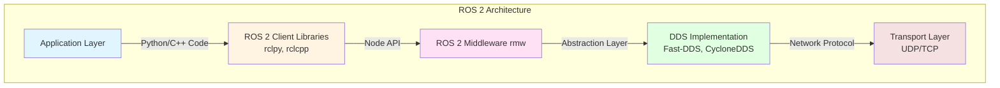

# Chapter 1.1: ROS 2 Overview

## Learning Objectives

By the end of this chapter, you will be able to:

1. Explain why roboticists use ROS 2 instead of writing custom communication protocols
2. Identify the key components of ROS 2 architecture (nodes, topics, DDS layer)
3. Describe how ROS 2 enables modular robot software development
4. Recognize when to use ROS 2 vs other robotics frameworks

## Prerequisites

### Required Knowledge
- Basic Python programming
- Linux command line basics
- Understanding of software architecture concepts (processes, messages, APIs)

### Previous Chapters
- None (this is the first chapter)

## Content

### What is ROS 2?

ROS 2 (Robot Operating System 2) is a **middleware framework** for building robot software. Despite its name, it's not an operating system like Linux or Windows—it's a collection of libraries, tools, and conventions that run on top of existing operating systems. ROS 2 provides the communication infrastructure that allows different parts of your robot software to talk to each other.

The original ROS (ROS 1) was created in 2007 at Willow Garage and became the de facto standard for academic and research robotics. However, ROS 1 had limitations for real-time systems, security, and multi-robot scenarios. ROS 2, released in 2017, addresses these issues by using **DDS (Data Distribution Service)**—a proven industrial middleware standard—for inter-process communication.

Today, ROS 2 is used by organizations ranging from NASA's Jet Propulsion Laboratory to autonomous vehicle companies and humanoid robotics startups. Its industry adoption validates it as production-ready, not just a research tool.

### Why Roboticists Use ROS 2

**The Problem**: Building robot software from scratch is incredibly complex. A humanoid robot might have 20+ motors (hip joints, knee joints, ankle servos, arm actuators), multiple sensors (IMU for balance, cameras for vision, force sensors in feet), and AI perception systems—all running simultaneously. Writing custom code to coordinate these components, handle timing issues, and manage communication protocols would take months and result in fragile, hard-to-debug monolithic applications.

**The Solution**: ROS 2 provides a **modular architecture** where each subsystem runs as an independent process called a "node." For example, you might have separate nodes for:
- `joint_controller` (sends motor commands)
- `imu_driver` (reads balance sensor)
- `camera_processor` (runs object detection)
- `motion_planner` (decides where to walk)

These nodes communicate via standardized message-passing interfaces, allowing you to develop, test, and debug each component independently.

**Key Benefits**:
1. **Code Reuse**: Thousands of open-source ROS 2 packages exist for common tasks (navigation, computer vision, manipulation planning). Instead of reinventing the wheel, you can leverage community-tested solutions.
2. **Hardware Abstraction**: ROS 2 provides generic interfaces (e.g., `sensor_msgs/JointState` for motor positions). This means you can swap hardware (switch from Dynamixel servos to custom actuators) without rewriting your control algorithms.
3. **Ecosystem and Tools**: ROS 2 includes visualization tools (RViz for 3D robot display), debugging utilities (`ros2 topic echo` to inspect messages), and simulation integrations (Gazebo, Isaac Sim).

### Key Concepts Preview

ROS 2 organizes communication around these core primitives:

- **Nodes**: Independent processes performing specific tasks. Each node focuses on one responsibility (single responsibility principle). Example: a `lidar_driver` node publishes laser scan data but doesn't need to know what other nodes do with that data.

- **Topics**: Asynchronous message streams for continuous data. Example: `/joint_states` topic publishes robot joint angles at 50 Hz. Any node can subscribe to this topic to get real-time joint information.

- **Services**: Synchronous request-reply patterns for occasional commands. Example: calling the `/reset_robot` service returns the robot to a safe home position and waits for confirmation.

- **Actions**: Long-running tasks with progress feedback. Example: the `/navigate_to_goal` action moves a robot to a target location while periodically reporting distance remaining.

- **URDF (Unified Robot Description Format)**: An XML-based format that describes your robot's physical structure—link dimensions, joint types, sensor locations, and collision geometry. URDF models are used by visualization tools (RViz), simulators (Gazebo), and motion planning libraries (MoveIt).

**Diagram**: ROS 2 high-level architecture showing how application code (your nodes) interacts with DDS for network communication.

### Motivation for Humanoid Control

Humanoid robots present unique challenges that make ROS 2 particularly valuable:

1. **High Degree-of-Freedom (DOF) Coordination**: A typical humanoid has 30+ DOF (12 in legs, 8 in arms, 2 in head, 10 in hands). Coordinating these joints requires real-time message passing between motion planners, joint controllers, and safety monitors. ROS 2's topic-based communication allows these systems to operate independently while staying synchronized.

2. **Sensor Fusion**: Balancing a humanoid requires fusing data from IMUs (acceleration, gyroscope), force-torque sensors in feet, and vision systems. ROS 2's standardized message types (`sensor_msgs/Imu`, `geometry_msgs/WrenchStamped`) make it easy to integrate sensor data from different manufacturers.

3. **Parallel Development**: With ROS 2's modular design, one developer can work on vision perception while another implements walking gaits—without conflicts. Each subsystem communicates through well-defined interfaces.

4. **Sim-to-Real Transfer**: You'll develop algorithms in simulators like Gazebo and Isaac Sim before deploying to hardware. ROS 2's consistent API means code written for simulation works on real robots with minimal changes (just swap the hardware driver node).

In the following chapters, you'll install ROS 2, create your first workspace, and start building the foundation for controlling humanoid robots.

## Summary

### Key Takeaways
- **ROS 2 is middleware, not an OS**: It provides communication infrastructure for robot software components
- **Modular architecture**: Nodes (independent processes) communicate via topics, services, and actions
- **DDS foundation**: ROS 2 uses industrial-grade Data Distribution Service for real-time, reliable messaging
- **Industry adoption**: Used by NASA, autonomous vehicle companies, and humanoid robotics startups
- **Humanoid robotics fit**: ROS 2's decoupled design is ideal for coordinating 30+ DOF, fusing sensor data, and enabling parallel development

### What's Next
In Chapter 1.2, you'll install ROS 2 Humble on Ubuntu 22.04 and create your first workspace.

## Exercises

None for this introductory chapter. Move on to Chapter 1.2 to begin hands-on installation.

## References

- Robot Operating System 2. (2023). *ROS 2 Humble documentation*. Retrieved December 7, 2025, from https://docs.ros.org/en/humble/
- Macenski, S., Foote, T., Gerkey, B., Lalancette, C., & Woodall, W. (2022). Robot Operating System 2: Design, architecture, and uses in the wild. *Science Robotics*, 7(66). https://doi.org/10.1126/scirobotics.abm6074
- Pyo, Y., Cho, H., Jung, R., & Lim, T. (2017). *ROS Robot Programming*. ROBOTIS Co., Ltd.

---

**Word Count**: ~520 words
