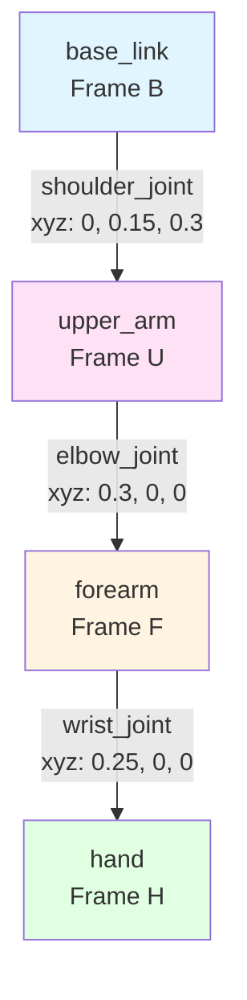

# Chapter 1.3: URDF Basics

## Learning Objectives

By the end of this chapter, you will be able to:

1. Write a valid URDF XML file defining a multi-joint robot
2. Explain the relationship between links, joints, and coordinate frames
3. Visualize URDF models in RViz and verify kinematic constraints
4. Debug common URDF errors (joint limits, collision geometry mismatches)

## Prerequisites

### Required Knowledge
- XML syntax basics (tags, attributes, nesting)
- 3D coordinate systems (x, y, z axes)
- Basic trigonometry (understanding of rotations in radians)

### Previous Chapters
- [Chapter 1.1: Overview](./overview.md) - Understanding ROS 2 concepts
- [Chapter 1.2: Installation](./installation.md) - ROS 2 environment setup

## Content

### What is URDF?

**URDF (Unified Robot Description Format)** is an XML-based specification for describing a robot's physical structure. It defines:
- **Geometry**: Physical dimensions and shapes of robot parts
- **Kinematics**: How parts connect and move relative to each other
- **Dynamics**: Mass, inertia, and collision properties
- **Sensors**: Camera, lidar, and force sensor locations

URDF files are consumed by multiple ROS 2 tools:
- **RViz**: 3D visualization of robot state
- **Gazebo**: Physics simulation with realistic dynamics
- **MoveIt**: Motion planning for manipulation tasks
- **robot_state_publisher**: Publishes transform tree to ROS 2

**Example use case**: A humanoid robot with 12-DOF legs, 8-DOF arms, and a 2-DOF head requires a URDF that precisely defines link dimensions, joint limits, and center-of-mass locations. Without an accurate URDF, simulation physics will be unrealistic and motion planning will fail.

### URDF Structure: Links and Joints

A URDF file consists of two primary elements: **links** (rigid bodies) and **joints** (connections between links).

#### Links: Rigid Bodies

A **link** represents a single rigid part of the robot. Each link can have three property types:

**1. Visual**: Geometry displayed in visualization tools (RViz)
**2. Collision**: Simplified geometry for collision detection (often boxes/cylinders for performance)
**3. Inertial**: Mass and inertia tensor for physics simulation

**Example link definition**:

```xml
<link name="base_link">
  <!-- Visual geometry (what you see in RViz) -->
  <visual>
    <geometry>
      <box size="0.1 0.1 0.05"/>  <!-- 10cm x 10cm x 5cm rectangular base -->
    </geometry>
    <material name="blue">
      <color rgba="0 0 0.8 1"/>  <!-- RGB + Alpha (blue, fully opaque) -->
    </material>
  </visual>

  <!-- Collision geometry (for physics simulation) -->
  <collision>
    <geometry>
      <box size="0.1 0.1 0.05"/>  <!-- Same as visual for simplicity -->
    </geometry>
  </collision>

  <!-- Inertial properties (mass and inertia matrix) -->
  <inertial>
    <mass value="1.0"/>  <!-- 1 kilogram -->
    <inertia ixx="0.001" ixy="0" ixz="0"
             iyy="0.001" iyz="0"
             izz="0.001"/>
  </inertial>
</link>
```

**Key concepts**:
- **Geometry primitives**: `<box>`, `<cylinder>`, `<sphere>`, `<mesh>` (for complex shapes from CAD files)
- **Material**: Visual appearance only (doesn't affect physics)
- **Inertia tensor**: 3x3 symmetric matrix describing rotational inertia. For simple shapes, use online calculators or physics formulas

#### Joints: Connections Between Links

A **joint** connects two links and defines their motion relationship. ROS 2 supports several joint types:

| Joint Type | Motion | Example Use Case |
|------------|--------|------------------|
| **fixed** | No movement | Camera mounted rigidly on robot head |
| **revolute** | Rotation with limits | Elbow joint (0° to 150°) |
| **continuous** | Unlimited rotation | Wheel axle |
| **prismatic** | Linear sliding | Telescope arm extension |
| **planar** | 2D plane motion | Rarely used, special cases |
| **floating** | 6-DOF free motion | Unanchored objects in simulation |

**Example revolute joint** (most common for humanoid robots):

```xml
<joint name="shoulder_joint" type="revolute">
  <!-- Parent link (fixed) and child link (moves) -->
  <parent link="torso"/>
  <child link="upper_arm"/>

  <!-- Joint origin: position and orientation relative to parent frame -->
  <origin xyz="0 0.15 0.3" rpy="0 0 0"/>
  <!-- xyz: [x, y, z] in meters (15cm left, 30cm up from torso origin) -->
  <!-- rpy: [roll, pitch, yaw] in radians (no rotation here) -->

  <!-- Rotation axis in parent frame coordinates -->
  <axis xyz="0 1 0"/>  <!-- Rotates around y-axis -->

  <!-- Joint limits and dynamics -->
  <limit lower="-1.57" upper="1.57" effort="50" velocity="2.0"/>
  <!-- lower/upper: -90° to +90° (in radians) -->
  <!-- effort: maximum torque in Newton-meters -->
  <!-- velocity: maximum angular velocity in rad/s -->
</joint>
```

**Understanding `<origin>` tag**:
- **xyz**: Translates child link's origin relative to parent
- **rpy**: Rotates child link using roll-pitch-yaw Euler angles (extrinsic xyz rotation sequence)
- **Critical detail**: The origin defines where the joint is located, NOT where the child link geometry is centered

### Coordinate Frames and Transformations

Every link in a URDF has its own **coordinate frame** (origin point + xyz axes). Understanding frame relationships is essential for correct robot modeling.

**Frame Conventions**:
- **Right-hand rule**: Thumb=x (forward), Index=y (left), Middle=z (up) for humanoid robotics
- **Parent-child hierarchy**: Each joint connects a parent link to a child link, forming a kinematic tree

**Example: 3-link arm**



**Kinematic tree**: Directed graph showing parent→child relationships. The robot has ONE root link (typically `base_link`) with no parent.

**Transformation math** (brief overview):
- Each joint defines a 4x4 homogeneous transformation matrix **T** = [R | p; 0 | 1]
- **R**: 3x3 rotation matrix (from rpy Euler angles)
- **p**: 3x1 position vector (from xyz)
- Forward kinematics: Multiply transformations along the chain to find end-effector pose

*Detailed transformation math is covered in the [Notation Guide](../notation.md).*

### 3-DOF Arm Example

Let's build a complete URDF for a simple robotic arm with 3 revolute joints.

**Design specifications**:
- **Link structure**:
  - `base_link`: Fixed platform (10cm cube)
  - `upper_arm`: 30cm long cylinder (5cm diameter)
  - `forearm`: 25cm long cylinder (4cm diameter)
  - `hand`: 10cm x 5cm x 5cm box (gripper placeholder)

- **Joint structure**:
  - `shoulder_joint`: Revolute, ±90° limits, rotates around y-axis
  - `elbow_joint`: Revolute, 0° to 150° limits, rotates around y-axis
  - `wrist_joint`: Continuous (unlimited rotation), rotates around x-axis

**Complete URDF** (simplified, full version in `examples/module1/urdf-models/simple_arm.urdf`):

```xml
<?xml version="1.0"?>
<robot name="simple_arm">
  <!-- Base Link (fixed platform) -->
  <link name="base_link">
    <visual>
      <geometry>
        <box size="0.1 0.1 0.1"/>
      </geometry>
      <material name="gray"><color rgba="0.5 0.5 0.5 1"/></material>
    </visual>
    <collision>
      <geometry><box size="0.1 0.1 0.1"/></geometry>
    </collision>
    <inertial>
      <mass value="2.0"/>
      <inertia ixx="0.0033" ixy="0" ixz="0" iyy="0.0033" iyz="0" izz="0.0033"/>
    </inertial>
  </link>

  <!-- Upper Arm Link -->
  <link name="upper_arm">
    <visual>
      <origin xyz="0.15 0 0" rpy="0 1.57 0"/>  <!-- Rotate cylinder to align with x-axis -->
      <geometry>
        <cylinder radius="0.025" length="0.3"/>  <!-- 5cm diameter, 30cm long -->
      </geometry>
      <material name="red"><color rgba="0.8 0 0 1"/></material>
    </visual>
    <collision>
      <origin xyz="0.15 0 0" rpy="0 1.57 0"/>
      <geometry><cylinder radius="0.025" length="0.3"/></geometry>
    </collision>
    <inertial>
      <mass value="1.5"/>
      <origin xyz="0.15 0 0"/>  <!-- Center of mass at mid-length -->
      <inertia ixx="0.0125" ixy="0" ixz="0" iyy="0.0125" iyz="0" izz="0.0001"/>
    </inertial>
  </link>

  <!-- Shoulder Joint (connects base to upper arm) -->
  <joint name="shoulder_joint" type="revolute">
    <parent link="base_link"/>
    <child link="upper_arm"/>
    <origin xyz="0 0 0.05" rpy="0 0 0"/>  <!-- 5cm above base -->
    <axis xyz="0 1 0"/>  <!-- Rotate around y-axis -->
    <limit lower="-1.57" upper="1.57" effort="50" velocity="2.0"/>
  </joint>

  <!-- Additional links and joints omitted for brevity -->
  <!-- Full URDF: examples/module1/urdf-models/simple_arm.urdf -->
</robot>
```

**Visualization in RViz**:

```bash
# Install URDF tutorial package (includes visualization launch files)
sudo apt install ros-humble-urdf-tutorial -y

# Launch RViz with joint state publisher GUI
ros2 launch urdf_tutorial display.launch.py model:=simple_arm.urdf
```

You'll see the 3-DOF arm in RViz with sliders to move each joint. This confirms your URDF is syntactically correct and visually reasonable.

### Common URDF Pitfalls

**Pitfall 1: Joint Limits Reversed**

```xml
<limit lower="1.57" upper="-1.57" effort="50" velocity="2.0"/>
<!-- WRONG: lower > upper -->
```

**Symptom**: RViz displays red error markers, joint doesn't move.
**Fix**: Ensure `lower < upper`. For unlimited rotation, use `type="continuous"` instead of `revolute`.

---

**Pitfall 2: Missing Inertial Properties**

```xml
<link name="arm">
  <visual><geometry><box size="0.1 0.1 0.1"/></geometry></visual>
  <!-- Missing <inertial> tag -->
</link>
```

**Symptom**: Gazebo simulation crashes with "inertia matrix not positive definite" error.
**Fix**: Always include `<inertial>` for simulated robots. Use realistic mass values (not 0 or negative).

---

**Pitfall 3: Collision Geometry Too Large**

```xml
<collision>
  <geometry><box size="1.0 1.0 1.0"/></geometry>  <!-- 1m cube -->
</collision>
<!-- But visual geometry is only 10cm cube -->
```

**Symptom**: Robot immediately detects self-collision in simulation, refuses to move.
**Fix**: Match collision geometry size to visual geometry (or use simplified but correctly scaled shapes).

---

**Pitfall 4: Origin xyz/rpy Typo**

```xml
<origin xyz="0.3 0 0" rpy="0 1.57 0"/>  <!-- Intended: rotate 90° around y -->
<origin xyz="0.3 0 0" rpy="1.57 0 0"/>  <!-- Actual: rotates 90° around x (WRONG!) -->
```

**Symptom**: Robot appears twisted or disjointed in RViz.
**Fix**: Double-check rpy values. Use RViz to visually verify orientation. Remember rpy order: roll (x), pitch (y), yaw (z).

---

**Debugging Tool**:

```bash
# Validate URDF syntax and joint tree
check_urdf simple_arm.urdf

# Expected output:
# robot name is: simple_arm
# ---------- Successfully Parsed XML ---------------
# root Link: base_link has 1 child(ren)
#     child(1):  upper_arm
#         child(1):  forearm
#             child(1):  hand
```

If `check_urdf` reports errors, fix them before attempting RViz visualization.

## Summary

### Key Takeaways
- **URDF defines robot structure**: Links (rigid bodies) + Joints (connections) form a kinematic tree
- **Link properties**: Visual (appearance), collision (physics), inertial (mass/inertia)
- **Joint types**: Fixed, revolute (limited rotation), continuous (unlimited), prismatic (linear)
- **Coordinate frames**: Each link has a frame; `<origin>` tag defines child-to-parent transformation
- **Common pitfalls**: Reversed joint limits, missing inertial properties, oversized collision geometry
- **Validation tools**: `check_urdf` for syntax, RViz for visual verification

### What's Next
In Chapter 1.4, you'll write Python nodes that publish joint commands and visualize URDF motion in real-time.

## Exercises

1. **Exercise 1.4** (⭐ Easy): Modify the `simple_arm.urdf` file to change the upper arm length from 30cm to 40cm. Verify the change in RViz by measuring the distance from shoulder to elbow joint.

2. **Exercise 1.5** (⭐⭐ Medium): Add a 4th joint to the wrist: `gripper_joint` (type: prismatic, limits: 0 to 0.05 meters). Create a simple gripper geometry (two small boxes that move apart when the joint extends). Visualize in RViz and confirm the joint slider controls gripper opening.

3. **Exercise 1.6** (⭐⭐⭐ Hard): Create a URDF for a 6-DOF humanoid leg with realistic joint limits based on human anatomy:
   - Hip joint (3-DOF): Approximate as 3 consecutive revolute joints (flexion/extension ±120°, abduction/adduction ±45°, internal/external rotation ±40°)
   - Knee joint (1-DOF): Revolute, 0° to 150° (no hyperextension)
   - Ankle joint (2-DOF): Dorsiflexion/plantarflexion ±30°, inversion/eversion ±20°

   **Grading criteria** (15 points):
   - URDF passes `check_urdf` validation (3 pts)
   - Joint limits match specified anatomy ranges within ±5° (5 pts)
   - Visualizes in RViz without self-collision when joints are at mid-range (4 pts)
   - Technical report (1 page) explains link dimensions and inertia calculations (3 pts)

## References

- Robot Operating System 2. (2023). *URDF specification*. Retrieved December 7, 2025, from http://wiki.ros.org/urdf
- Siciliano, B., & Khatib, O. (Eds.). (2016). *Springer Handbook of Robotics* (2nd ed.). Springer. (Chapter on robot kinematics)
- Lynch, K. M., & Park, F. C. (2017). *Modern Robotics: Mechanics, Planning, and Control*. Cambridge University Press.

---

**Word Count**: ~1020 words
