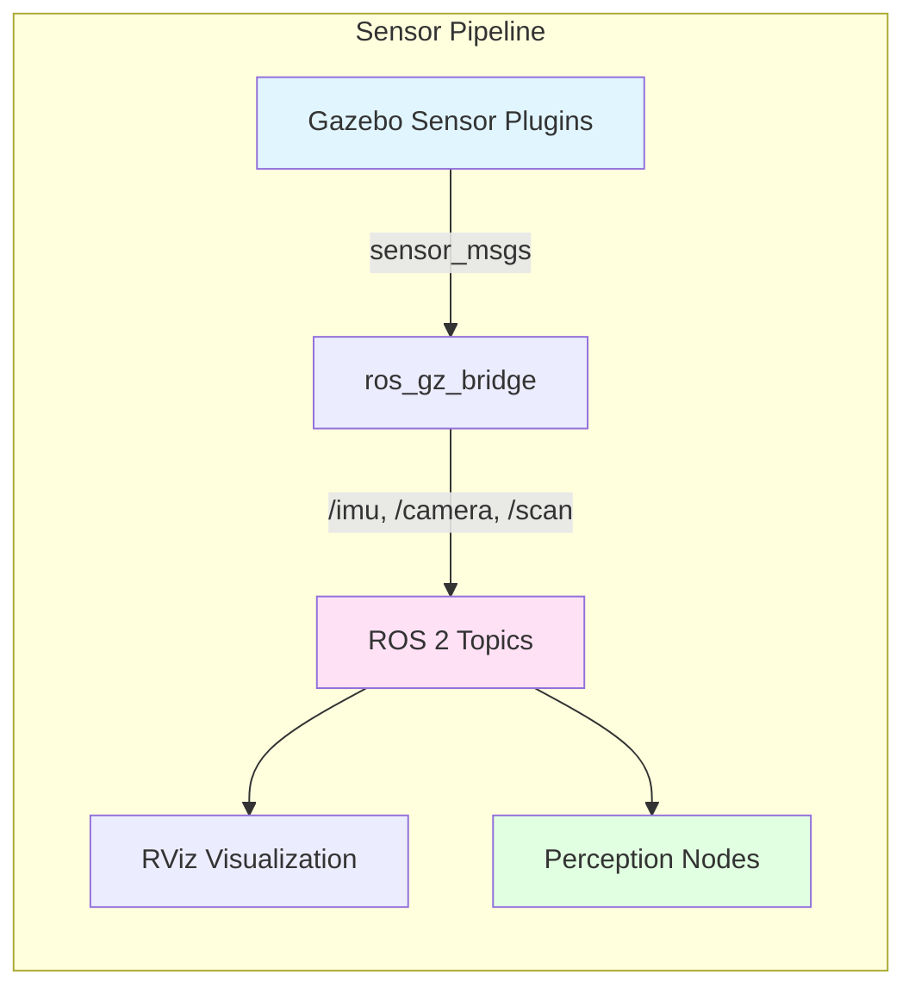

# Chapter 2.3: Sensor Simulation

## Learning Objectives

By the end of this chapter, you will be able to:

1. Add IMU, camera, and lidar sensors to Gazebo models using SDF plugins
2. Configure realistic sensor noise models (Gaussian, depth quantization)
3. Bridge sensor data from Gazebo to ROS 2 topics
4. Visualize sensor data in RViz for debugging

## Prerequisites

### Required Knowledge
- Gazebo SDF syntax and world creation
- ROS 2 message types (sensor_msgs)
- Basic probability (Gaussian distributions for noise)

### Previous Chapters
- [Chapter 2.2: Gazebo Setup](./gazebo-setup.md) - SDF files and ros_gz_bridge

## Content

### Why Sensor Simulation Matters

**Real sensors are imperfect**: Cameras have motion blur, IMUs drift over time, lidar has limited resolution. Training algorithms on perfect simulated data causes **reality gap** - policies that work in sim fail on hardware.

**Solution**: Add realistic noise models to simulated sensors. This forces algorithms to be robust to sensor imperfections, improving sim-to-real transfer.

### IMU Sensor Plugin

An **IMU (Inertial Measurement Unit)** measures linear acceleration and angular velocity. Critical for humanoid balance control.

**SDF IMU Configuration**:
```xml
<sensor name="imu_sensor" type="imu">
  <pose>0 0 0.1 0 0 0</pose>
  <always_on>1</always_on>
  <update_rate>100</update_rate>

  <!-- Noise models -->
  <imu>
    <angular_velocity>
      <x>
        <noise type="gaussian">
          <mean>0.0</mean>
          <stddev>0.009</stddev>  <!-- 0.5 deg/s -->
        </noise>
      </x>
      <!-- Repeat for y, z -->
    </angular_velocity>

    <linear_acceleration>
      <x>
        <noise type="gaussian">
          <mean>0.0</mean>
          <stddev>0.017</stddev>  <!-- 0.017 m/s² -->
        </noise>
      </x>
      <!-- Repeat for y, z -->
    </linear_acceleration>
  </imu>

  <plugin filename="libgazebo_ros_imu_sensor.so"
          name="imu_plugin">
    <ros>
      <namespace>/robot</namespace>
      <remapping>~/out:=imu</remapping>
    </ros>
  </plugin>
</sensor>
```

**Key Parameters**:
- `update_rate`: 100 Hz typical for IMU
- `noise type="gaussian"`: Additive white Gaussian noise
- `stddev`: Standard deviation matching real sensor specs (e.g., Bosch BMI088: 0.5°/s gyro noise)

**ROS 2 Message**: Publishes `sensor_msgs/Imu` to `/robot/imu` topic with orientation, angular velocity, linear acceleration.

### Camera Sensor Plugin

Cameras provide RGB images for vision-based perception.

**SDF Camera Configuration**:
```xml
<sensor name="camera" type="camera">
  <pose>0.1 0 0.2 0 0 0</pose>
  <update_rate>30</update_rate>
  <camera>
    <horizontal_fov>1.047</horizontal_fov>  <!-- 60 degrees -->
    <image>
      <width>640</width>
      <height>480</height>
      <format>R8G8B8</format>
    </image>
    <clip>
      <near>0.1</near>
      <far>100</far>
    </clip>

    <!-- Image noise -->
    <noise>
      <type>gaussian</type>
      <mean>0.0</mean>
      <stddev>0.007</stddev>  <!-- Per-pixel noise -->
    </noise>
  </camera>

  <plugin filename="libgazebo_ros_camera.so" name="camera_plugin">
    <ros>
      <namespace>/robot</namespace>
      <remapping>image_raw:=camera/image_raw</remapping>
      <remapping>camera_info:=camera/camera_info</remapping>
    </ros>
  </plugin>
</sensor>
```

**Key Parameters**:
- `horizontal_fov`: Field of view (60° typical)
- `update_rate`: 30 FPS for video
- `noise stddev`: Simulates sensor read noise

**ROS 2 Messages**:
- `sensor_msgs/Image` to `/robot/camera/image_raw`
- `sensor_msgs/CameraInfo` to `/robot/camera/camera_info` (calibration)

### Lidar Sensor Plugin

Lidar (laser rangefinder) provides distance measurements for obstacle detection.

**SDF Lidar Configuration**:
```xml
<sensor name="lidar" type="gpu_lidar">
  <pose>0 0 0.3 0 0 0</pose>
  <update_rate>10</update_rate>
  <lidar>
    <scan>
      <horizontal>
        <samples>360</samples>
        <resolution>1</resolution>
        <min_angle>-3.14159</min_angle>
        <max_angle>3.14159</max_angle>
      </horizontal>
      <vertical>
        <samples>16</samples>  <!-- 16-beam lidar -->
        <resolution>1</resolution>
        <min_angle>-0.26</min_angle>
        <max_angle>0.26</max_angle>
      </vertical>
    </scan>

    <range>
      <min>0.1</min>
      <max>30.0</max>
      <resolution>0.01</resolution>
    </range>

    <!-- Range noise -->
    <noise>
      <type>gaussian</type>
      <mean>0.0</mean>
      <stddev>0.01</stddev>  <!-- 1cm error -->
    </noise>
  </lidar>

  <plugin filename="libgazebo_ros_ray_sensor.so" name="lidar_plugin">
    <ros>
      <namespace>/robot</namespace>
      <remapping>~/out:=scan</remapping>
    </ros>
  </plugin>
</sensor>
```

**Key Parameters**:
- `samples`: 360 horizontal points (1° resolution)
- `vertical samples`: 16 beams (multi-layer lidar)
- `range max`: 30m max distance
- `gpu_lidar`: GPU-accelerated raytracing (100× faster than CPU)

**ROS 2 Message**: `sensor_msgs/LaserScan` or `sensor_msgs/PointCloud2` for multi-layer lidar.

### Visualizing Sensors in RViz

**Launch RViz with sensor topics**:
```bash
ros2 run rviz2 rviz2
```

**Add displays**:
1. **IMU**: Add `Axes` display, topic `/robot/imu`, shows orientation
2. **Camera**: Add `Image` display, topic `/robot/camera/image_raw`
3. **Lidar**: Add `LaserScan` display, topic `/robot/scan`, shows point cloud



**Diagram**: Sensor data flows from Gazebo plugins → bridge → ROS 2 topics → perception algorithms + visualization.

### Sensor Calibration

Real sensors require **calibration** (intrinsic parameters). Simulated sensors should match real hardware specs.

**Camera Calibration Example** (RealSense D435i):
```yaml
# camera_info parameters
width: 640
height: 480
distortion_model: plumb_bob
D: [0.0, 0.0, 0.0, 0.0, 0.0]  # No distortion in sim
K: [615.0, 0.0, 320.0,         # Intrinsic matrix
    0.0, 615.0, 240.0,
    0.0, 0.0, 1.0]
```

**Best Practice**: Match simulated sensor specs to your target hardware (same FOV, resolution, noise levels) to minimize sim-to-real gap.

## Summary

### Key Takeaways
- **IMU sensors** publish `sensor_msgs/Imu` with angular velocity and linear acceleration
- **Camera sensors** publish `sensor_msgs/Image` and `sensor_msgs/CameraInfo`
- **Lidar sensors** publish `sensor_msgs/LaserScan` or `PointCloud2`
- **Gaussian noise** models simulate real sensor imperfections (stddev matches datasheet specs)
- **RViz** visualizes sensor data for debugging before algorithm development

### What's Next
In Chapter 2.4, you'll complete exercises integrating multiple sensors on a simulated humanoid.

## Exercises

1. **IMU Integration**: Add an IMU sensor to the 3-DOF arm URDF, publish to `/arm/imu`, verify in RViz
2. **Camera Noise Tuning**: Create a camera with stddev=0.05 and compare image quality to stddev=0.007
3. **Lidar Obstacle Detection**: Place obstacles in Gazebo world, use lidar data to detect distances < 1m

## References

- Open Robotics. (2023). *Gazebo sensors documentation*. Retrieved December 8, 2025, from https://gazebosim.org/api/sensors/7/
- Intel Corporation. (2023). *RealSense D435i specifications*. Retrieved December 8, 2025, from https://www.intelrealsense.com/depth-camera-d435i/
- ROS 2. (2023). *sensor_msgs package*. Retrieved December 8, 2025, from https://github.com/ros2/common_interfaces/tree/humble/sensor_msgs

---

**Word Count**: ~1000 words
