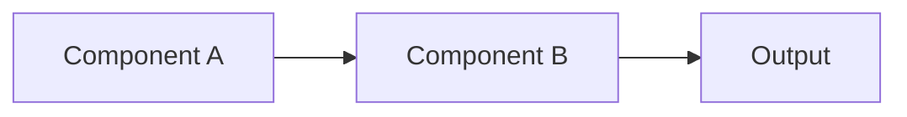

# [Chapter Title]

## Learning Objectives

By the end of this chapter, you will be able to:

1. [Objective 1 - action verb + measurable outcome]
2. [Objective 2 - action verb + measurable outcome]
3. [Objective 3 - action verb + measurable outcome]
4. [Optional: Objective 4]
5. [Optional: Objective 5]

**Time to complete**: [estimated time in hours]

---

## Prerequisites

### Required Knowledge

- [Prerequisite 1 - e.g., "Python functions and classes"]
- [Prerequisite 2 - e.g., "Linear algebra basics (vectors, matrices)"]
- [Prerequisite 3 - specific to this guide]

### Previous Chapters

- [Link to prerequisite chapter if applicable]
- [e.g., "[Module 1: ROS 2 Installation](../module1/installation.md)"]

### Software Requirements

- [Software 1 with version - e.g., "ROS 2 Humble Hawksbill"]
- [Software 2 with version - e.g., "Python 3.10+"]
- [Hardware requirements if applicable - e.g., "RTX 4070 Ti GPU or better"]

---

## Content

### Introduction

[1-2 paragraphs motivating WHY this topic matters. Connect to real-world applications or hackathon project goals.]

**Key Question**: [Pose a question this chapter answers]

---

### Core Concepts

#### Concept 1: [Heading]

[Explanation with definition, purpose, and context]

**Example**:
```[language]
# Code example illustrating Concept 1
# Include comments explaining WHY, not just WHAT
```

**Key Takeaway**: [One sentence summarizing concept]

---

#### Concept 2: [Heading]

[Explanation building on Concept 1]

**Diagram**: [Reference diagram if applicable]



**Related Glossary Terms**: [[Term1](../../glossary.md#term1)], [[Term2](../../glossary.md#term2)]

---

#### Concept 3: [Heading]

[Continue pattern for all core concepts]

---

### Worked Example: [Descriptive Title]

**Scenario**: [Describe realistic use case]

**Step 1**: [Action with command/code]

```[language]
# Full working code example
# Requires: [dependencies with versions]
```

**Step 2**: [Next action]

**Step 3**: [Final step]

**Expected Output**:
```
[Show what student should see]
```

**Common Pitfalls**:
- ❌ **Mistake**: [Common error]
  - ✅ **Fix**: [How to resolve]
- ❌ **Mistake**: [Another common error]
  - ✅ **Fix**: [How to resolve]

---

### Applications

[2-3 paragraphs showing HOW concepts apply to humanoid robotics, hackathon projects, or real-world systems]

**Connection to Capstone**: [Explain how this chapter supports Module 5 final project]

---

## Summary

### Key Takeaways

- **[Concept 1]**: [One sentence summary]
- **[Concept 2]**: [One sentence summary]
- **[Concept 3]**: [One sentence summary]
- **[Optional: Additional point]**

### What's Next

In the [next chapter/module], you will learn [preview of upcoming content and how it builds on this chapter].

---

## Exercises

### Exercise 1: [Conceptual] - [Title]

**Difficulty**: ⭐ Easy | ⭐⭐ Medium | ⭐⭐⭐ Hard

**Type**: Conceptual (understanding without code)

**Question**: [Pose a question testing comprehension]

**Hints**:
1. [Hint 1 - guide toward answer without giving it away]
2. [Hint 2]

<details>
<summary>Click to reveal solution</summary>

**Answer**: [Detailed explanation of correct answer]

**Why This Matters**: [Connect to learning objective]

</details>

---

### Exercise 2: [Computational] - [Title]

**Difficulty**: ⭐⭐ Medium

**Type**: Computational (calculations, analysis)

**Task**: [Describe calculation or analysis to perform]

**Given**:
- [Parameter 1]: [value with units]
- [Parameter 2]: [value with units]

**Calculate**: [What student must determine]

<details>
<summary>Click to reveal solution</summary>

**Solution**:
$$
[Show mathematical working]
$$

**Result**: [Final answer with units]

**Verification**: [How to check answer is reasonable]

</details>

---

### Exercise 3: [Implementation] - [Title]

**Difficulty**: ⭐⭐⭐ Hard

**Type**: Implementation (hands-on coding/system building)

**Objective**: [Describe what student will build]

**Requirements**:
1. [Requirement 1 with acceptance criteria]
2. [Requirement 2 with acceptance criteria]
3. [Requirement 3 with acceptance criteria]

**Starter Code**: See `examples/[module]/[chapter]/exercise3_starter.py`

**Validation**:
```bash
# Command to test implementation
python exercise3_test.py
```

**Expected Outcome**: [Describe successful completion]

<details>
<summary>Click to reveal hints</summary>

**Hints**:
1. [Architectural hint - e.g., "Use a publisher-subscriber pattern"]
2. [Implementation hint - e.g., "Set rate to 10Hz to match Gazebo physics"]
3. [Debugging hint - e.g., "Use `ros2 topic echo` to verify messages"]

</details>

---

## References

### Primary Sources

- [Author, Year]: [APA citation - link to references.md#anchor]
- [Author, Year]: [APA citation]

### Documentation

- [Official Docs]: [Link to external documentation with access date]

### Further Reading (Optional)

- [Advanced topic resource]
- [Related tutorial or paper]

---

## Metadata

**Word Count Target**: [e.g., 1500-2000 words for this chapter]

**Code Examples**: [Number of examples]

**Diagrams**: [Number of diagrams]

**Exercises**: 3 minimum (1 conceptual, 1 computational, 1 implementation)

**Estimated Time to Complete**: [X hours including reading + exercises]

---

## Notes for Authors

- **Voice**: Use second person for tutorials ("you will create..."), third person for theory ("the robot computes...")
- **Glossary Links**: Link terms on first use per chapter
- **Code Comments**: Explain WHY, not WHAT (assume readers can read code)
- **Images**: Alt text must be descriptive, not "image of robot"
- **APA Citations**: Add all sources to references.md first
- **Accessibility**: Ensure color contrast ≥ 4.5:1, keyboard navigation works
- **Constitution Check**: Verify all 6 sections present before marking chapter complete
