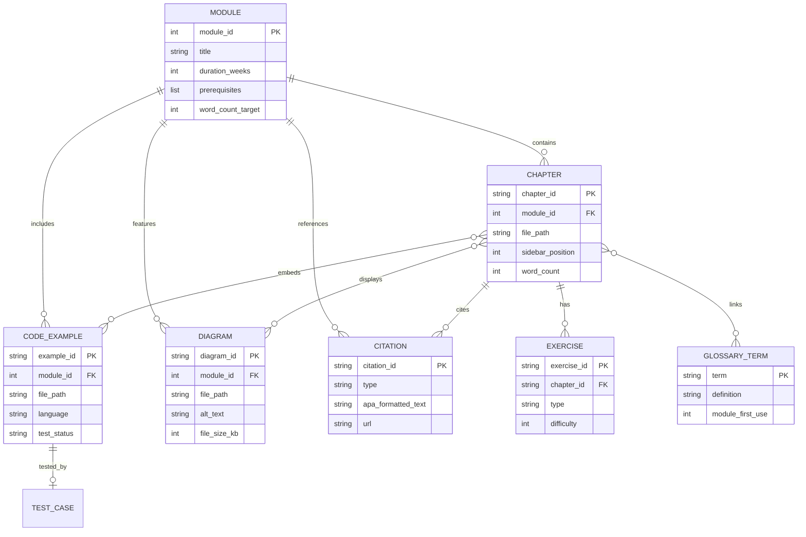

# Data Model: Physical AI & Humanoid Robotics Hackathon Guide

**Purpose**: Define content entities, relationships, and validation rules for Docusaurus-based educational guide.

## Content Entities

### 1. Module

**Description**: Top-level organizational unit representing 1-3 weeks of course material (e.g., "ROS 2 Foundation", "Digital Twin Simulation").

**Attributes**:
- `module_id` (integer 1-5): Unique identifier and ordering
- `title` (string): Display name (e.g., "Module 1: ROS 2 Foundation for Humanoid Control")
- `description` (string, max 200 chars): Brief summary for metadata
- `duration_weeks` (integer 1-3): Estimated completion time
- `prerequisites` (list of module_ids): Required prior modules
- `learning_objectives` (list of strings, 3-5 items): Measurable outcomes
- `word_count_target` (integer 4000-6000): Total words across all chapters

**Relationships**:
- Contains 4-6 **Chapters**
- Precedes next **Module** (forms dependency DAG)
- References 10-20 **Citations**

**Validation Rules**:
- Sum of chapter word_counts ≤ word_count_target
- Prerequisites form directed acyclic graph (no cycles)
- Learning objectives use measurable verbs (create, explain, demonstrate, integrate)

**Example**:
```json
{
  "module_id": 1,
  "title": "Module 1: ROS 2 Foundation for Humanoid Control",
  "description": "Learn ROS 2 nodes, topics, URDF modeling, and robot visualization",
  "duration_weeks": 2,
  "prerequisites": [],
  "learning_objectives": [
    "Install ROS 2 Humble and create workspaces using colcon",
    "Define humanoid robot models using URDF syntax",
    "Write Python nodes to publish/subscribe to joint state topics",
    "Visualize robot configurations in RViz"
  ],
  "word_count_target": 5500
}
```

### 2. Chapter

**Description**: Single-page content unit covering one concept (max 2000 words to meet constitution requirement).

**Attributes**:
- `chapter_id` (string): Unique identifier (e.g., "m1-c3" for Module 1, Chapter 3)
- `module_id` (integer): Parent module
- `title` (string): Display name (e.g., "URDF Basics: Defining Humanoid Robots")
- `file_path` (string): Relative path from repo root (e.g., "docs/module1/urdf-basics.md")
- `sidebar_position` (integer): Ordering within module
- `word_count` (integer, max 2000): Actual content length
- `frontmatter` (object): Docusaurus metadata (title, description, keywords)
- `sections` (list of strings): Internal structure (Learning Objectives, Prerequisites, Content, Summary, Exercises, References)

**Relationships**:
- Belongs to one **Module**
- Contains 3+ **Exercises**
- References 5-10 **Citations**
- Embeds 1-5 **Code Examples**
- Embeds 1-3 **Diagrams**
- Links to 3-10 **Glossary Terms**

**Validation Rules**:
- Word count ≤ 2000 (constitution Principle IV)
- Follows template structure (6 mandatory sections)
- Frontmatter includes title, description, keywords, sidebar_position
- File path matches module directory structure

**Example**:
```json
{
  "chapter_id": "m1-c3",
  "module_id": 1,
  "title": "URDF Basics: Defining Humanoid Robots",
  "file_path": "docs/module1/urdf-basics.md",
  "sidebar_position": 3,
  "word_count": 1000,
  "frontmatter": {
    "title": "URDF Basics: Defining Humanoid Robots",
    "description": "Learn URDF XML syntax for modeling robot kinematics, joints, and links",
    "keywords": ["urdf", "robot model", "joints", "links", "ros2"],
    "sidebar_position": 3
  },
  "sections": ["Learning Objectives", "Prerequisites", "Content", "Summary", "Exercises", "References"]
}
```

### 3. Code Example

**Description**: Tested, runnable code snippet (Python, XML, YAML) demonstrating a concept.

**Attributes**:
- `example_id` (string): Unique identifier (e.g., "m1-ex5-urdf-publisher")
- `module_id` (integer): Parent module
- `file_path` (string): Relative path (e.g., "examples/module1/ros2-basics/urdf_publisher.py")
- `language` (enum): Python | XML | YAML | Bash
- `dependencies` (list of strings): Version-pinned packages (e.g., "rclpy>=3.3.0", "numpy>=1.24.0")
- `test_status` (enum): passed | failed | manual
- `last_tested_date` (ISO date): When example was validated
- `readme_path` (string): Setup instructions (e.g., "examples/module1/ros2-basics/README.md")
- `comments` (boolean): Whether code explains WHY (not just WHAT)

**Relationships**:
- Belongs to one **Module**
- Embedded in 1+ **Chapters**
- Tested by **Test Case** (Tier 1/2) or **Manual Validation** (Tier 3)

**Validation Rules**:
- Syntax valid (Tier 1: flake8 passes for Python)
- Dependencies version-pinned (no `pkg>=1.0` without upper bound)
- Includes README with setup steps and expected output
- Comments explain WHY not WHAT (constitution Principle V)
- Safety warnings for hardware-interacting code

**Example**:
```json
{
  "example_id": "m1-ex2-urdf-simple-arm",
  "module_id": 1,
  "file_path": "examples/module1/urdf-models/simple_arm.urdf",
  "language": "XML",
  "dependencies": ["ros2-humble-urdf", "ros2-humble-robot-state-publisher"],
  "test_status": "passed",
  "last_tested_date": "2025-12-07",
  "readme_path": "examples/module1/urdf-models/README.md",
  "comments": true
}
```

### 4. Diagram

**Description**: Visual representation (Mermaid inline or Excalidraw SVG) illustrating system architecture, hardware setup, or data flow.

**Attributes**:
- `diagram_id` (string): Unique identifier (e.g., "m1-d1-ros2-node-graph")
- `module_id` (integer): Parent module
- `file_path` (string): Relative path (e.g., "static/img/module1/ros2-node-graph.svg")
- `type` (enum): mermaid | excalidraw
- `alt_text` (string, max 200 chars): Descriptive text for accessibility
- `file_size_kb` (integer, max 500): Optimized size
- `source_file` (string, optional): Editable source (e.g., .excalidraw JSON)

**Relationships**:
- Belongs to one **Module**
- Embedded in 1+ **Chapters**

**Validation Rules**:
- Alt text is descriptive (not "image of robot" or "diagram 1")
- File size < 500KB (constitution Principle VI)
- SVG optimized with `svgo`
- Mermaid diagrams render correctly in Docusaurus preview

**Example**:
```json
{
  "diagram_id": "m1-d1-ros2-node-graph",
  "module_id": 1,
  "file_path": "static/img/module1/ros2-node-graph.svg",
  "type": "mermaid",
  "alt_text": "ROS 2 node graph showing publisher-subscriber pattern with /joint_states topic connecting URDF publisher to RViz subscriber",
  "file_size_kb": 12,
  "source_file": null
}
```

### 5. Exercise

**Description**: Practice problem for students (conceptual, computational, or implementation).

**Attributes**:
- `exercise_id` (string): Unique identifier (e.g., "m1-c3-ex2-inertia-calc")
- `chapter_id` (string): Parent chapter
- `type` (enum): conceptual | computational | implementation
- `difficulty` (integer 1-3): Beginner (1), Intermediate (2), Advanced (3)
- `estimated_time_min` (integer 15-60): Expected completion time
- `prompt` (string): Problem statement
- `solution_provided` (boolean): Whether answer key exists
- `solution_path` (string, optional): Relative path to solution file

**Relationships**:
- Belongs to one **Chapter**
- May reference **Code Examples** or **Diagrams**

**Validation Rules**:
- Each chapter has at least one of each type (conceptual, computational, implementation)
- Solutions stored separately (not inline in chapter)
- Difficulty aligns with chapter position (early chapters = easier)

**Example**:
```json
{
  "exercise_id": "m1-c3-ex2-inertia-calc",
  "chapter_id": "m1-c3",
  "type": "computational",
  "difficulty": 2,
  "estimated_time_min": 30,
  "prompt": "Calculate the inertia tensor for a cylindrical link with mass 2kg, radius 0.05m, and length 0.3m. Provide values for Ixx, Iyy, Izz.",
  "solution_provided": true,
  "solution_path": "docs/module1/solutions/ex2-inertia.md"
}
```

### 6. Citation

**Description**: APA 7th edition formatted reference to external source (paper, documentation, textbook, GitHub repo).

**Attributes**:
- `citation_id` (string): Unique identifier (e.g., "ros2-humble-docs")
- `type` (enum): paper | documentation | textbook | repository
- `apa_formatted_text` (string): Full APA citation
- `url` (string, optional): Hyperlink (for web sources)
- `access_date` (ISO date, optional): When URL was accessed (required for documentation)
- `doi` (string, optional): Digital Object Identifier (for papers)

**Relationships**:
- Referenced by 1+ **Chapters**

**Validation Rules**:
- APA 7th edition compliant (validated with Scribbr checker)
- URL accessible (link check passes)
- Unique citation_id (no duplicates)
- Access date provided for web documentation

**Example**:
```json
{
  "citation_id": "ros2-humble-docs",
  "type": "documentation",
  "apa_formatted_text": "Robot Operating System 2. (2023). ROS 2 Humble documentation. Retrieved December 7, 2025, from https://docs.ros.org/en/humble/",
  "url": "https://docs.ros.org/en/humble/",
  "access_date": "2025-12-07",
  "doi": null
}
```

### 7. Glossary Term

**Description**: Robotics/AI terminology definition (single source of truth).

**Attributes**:
- `term` (string): Technical term (e.g., "URDF", "IMU", "mAP")
- `definition` (string, max 300 chars): Concise explanation
- `module_first_use` (integer): Which module introduces the term
- `related_terms` (list of strings): Cross-references

**Relationships**:
- Linked from 1+ **Chapters**
- Stored in `docs/glossary.md`

**Validation Rules**:
- Defined in `docs/glossary.md` (single file)
- Linked on first use per chapter (constitution Principle II)
- Alphabetically sorted in glossary

**Example**:
```json
{
  "term": "URDF",
  "definition": "Unified Robot Description Format - XML-based specification for modeling robot kinematics, dynamics, and visual properties in ROS 2.",
  "module_first_use": 1,
  "related_terms": ["SDF", "COLLADA", "RViz"]
}
```

## Entity Relationships Diagram



## Validation Summary

**Pre-merge validation checklist** (all entities must pass):

### Module Validation
- [ ] module_id unique (1-5)
- [ ] Prerequisites form DAG (no circular dependencies)
- [ ] Sum of chapter word counts ≤ word_count_target
- [ ] Learning objectives use measurable verbs
- [ ] Duration matches actual chapter count (6 chapters ≈ 2 weeks)

### Chapter Validation
- [ ] Word count ≤ 2000
- [ ] Frontmatter complete (title, description, keywords, sidebar_position)
- [ ] File path matches module directory
- [ ] Contains all 6 mandatory sections
- [ ] At least 3 exercises (one of each type)
- [ ] At least 5 citations

### Code Example Validation
- [ ] Syntax valid (flake8 passes)
- [ ] Dependencies version-pinned
- [ ] README exists with setup steps
- [ ] Test status is "passed" or documented manual validation
- [ ] Last tested date within 30 days of merge
- [ ] Comments explain WHY not WHAT

### Diagram Validation
- [ ] Alt text descriptive (≥ 20 chars, not generic)
- [ ] File size < 500KB
- [ ] SVG optimized (for external diagrams)
- [ ] Renders correctly in Docusaurus preview

### Exercise Validation
- [ ] Type is one of: conceptual, computational, implementation
- [ ] Difficulty appropriate for chapter position
- [ ] Estimated time realistic (15-60 min)
- [ ] Solution provided or marked as optional

### Citation Validation
- [ ] APA 7th edition compliant (Scribbr check passes)
- [ ] URL accessible (for web sources)
- [ ] Access date provided (for documentation)
- [ ] Unique citation_id

### Glossary Term Validation
- [ ] Defined in `docs/glossary.md`
- [ ] Linked on first use per chapter
- [ ] Definition concise (≤ 300 chars)
- [ ] Alphabetically sorted

## Data Model Status

**Status**: Phase 1 complete - Entity definitions and validation rules established.

**Next steps**:
1. Create module outline templates in `contracts/`
2. Generate quickstart guide for contributors
3. Update agent context with data model
4. Proceed to `/sp.tasks` for task generation
