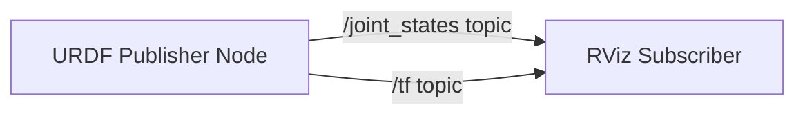

# Quickstart: Contributing to Physical AI & Humanoid Robotics Guide

**Target audience**: Content writers, AI assistants (Claude Code), and technical reviewers contributing to the Docusaurus-based educational guide.

## Prerequisites

- Node.js 18+ and npm 8+
- Git
- Text editor (VS Code recommended with Markdown preview)
- Python 3.10+ (for code example validation)
- ROS 2 Humble (optional, for testing robotics examples)

## Initial Setup

### 1. Clone Repository

```bash
git clone https://github.com/[org]/physical-ai-robotics-guide.git
cd physical-ai-robotics-guide
```

### 2. Install Docusaurus Dependencies

```bash
cd my-website
npm install
```

**Expected output**:
```
added 1234 packages in 45s
```

### 3. Start Local Development Server

```bash
npm start
```

**Expected output**:
```
[INFO] Starting the development server...
[SUCCESS] Docusaurus website is running at: http://localhost:3000/
```

Opens browser at `http://localhost:3000` with hot reload (changes auto-refresh).

## Project Structure

```
physical-ai-robotics-guide/
├── my-website/               # Docusaurus root
│   ├── docs/                 # Markdown content
│   │   ├── intro.md          # Homepage
│   │   ├── glossary.md       # Terminology (single source of truth)
│   │   ├── notation.md       # Mathematical symbols
│   │   ├── references.md     # APA citations (centralized)
│   │   ├── module1/          # ROS 2 Foundation (6 chapters)
│   │   ├── module2/          # Digital Twin Simulation (6 chapters)
│   │   ├── module3/          # AI Perception & Navigation (6 chapters)
│   │   ├── module4/          # VLA Integration (5 chapters)
│   │   └── module5/          # Capstone Project (5 chapters)
│   ├── static/
│   │   └── img/              # Diagrams and screenshots
│   │       ├── module1/
│   │       ├── module2/
│   │       └── ...
│   ├── examples/             # Code examples (outside Docusaurus build)
│   │   ├── module1/
│   │   │   ├── ros2-basics/
│   │   │   │   ├── README.md
│   │   │   │   ├── urdf_publisher.py
│   │   │   │   └── requirements.txt
│   │   │   └── ...
│   │   └── ...
│   ├── src/
│   │   └── components/       # Custom React components (MDX)
│   ├── sidebars.js           # Navigation configuration
│   ├── docusaurus.config.js  # Site configuration
│   └── package.json
└── specs/
    └── 001-hackathon-guide/  # Project specs
        ├── spec.md           # Feature requirements
        ├── plan.md           # Implementation plan
        ├── research.md       # Technology decisions
        ├── data-model.md     # Content entities
        ├── quickstart.md     # This file
        └── contracts/        # Module outlines
```

## Writing Workflow

### Step 1: Check Specification

Before writing, review relevant documents:
1. **spec.md**: Feature requirements and success criteria
2. **contracts/module[N]-outline.md**: Detailed chapter structure
3. **constitution** (`.specify/memory/constitution.md`): Quality standards

### Step 2: Create Feature Branch

```bash
git checkout -b chapter/module1-urdf-basics
```

**Naming convention**: `chapter/module[N]-[topic-slug]`

### Step 3: Write Content

Follow chapter template structure:

````markdown
---
title: "URDF Basics: Defining Humanoid Robots"
description: "Learn URDF XML syntax for modeling robot kinematics, joints, and links"
keywords: [urdf, robot model, joints, links, ros2]
sidebar_position: 3
---

## Learning Objectives

By the end of this chapter, you will be able to:
1. Explain URDF XML structure for robot models
2. Define joints (revolute, prismatic, fixed) and links with properties
3. Create a 3-DOF robotic arm URDF and visualize in RViz
4. Calculate inertia tensors for simple geometric shapes

## Prerequisites

- **Prior chapters**: Module 1 Chapter 1 (ROS 2 Installation), Chapter 2 (Workspace Setup)
- **External knowledge**: XML syntax, basic linear algebra (vectors, matrices)

## Introduction

[Motivation: Why learn URDF? Problem it solves]

...

## Core Concepts

### URDF XML Structure

[Formal definition with example]

```xml
<robot name="simple_arm">
  <link name="base_link">
    <!-- Visual, collision, inertial properties -->
  </link>
  <joint name="joint1" type="revolute">
    <!-- Parent, child, axis, limits -->
  </joint>
</robot>
```

...

## Applications

[Real-world use cases]

## Summary

Key takeaways:
- URDF is XML-based robot description format
- Links define physical properties, joints define connections
- RViz visualizes URDF models for debugging

## Exercises

### Exercise 1: Conceptual
**Question**: Explain why collision geometry should be simpler than visual geometry.

**Difficulty**: 1 | **Time**: 15 min

### Exercise 2: Computational
**Question**: Calculate the inertia tensor for a cylindrical link with mass 2kg, radius 0.05m, length 0.3m.

**Difficulty**: 2 | **Time**: 30 min

### Exercise 3: Implementation
**Question**: Modify `simple_arm.urdf` to add a 4th DOF and visualize in RViz.

**Difficulty**: 2 | **Time**: 45 min

## References

- Robot Operating System 2. (2023). *ROS 2 Humble documentation: URDF specification*. Retrieved December 7, 2025, from https://docs.ros.org/en/humble/Tutorials/Intermediate/URDF/URDF-Main.html
- Siciliano, B., & Khatib, O. (Eds.). (2016). *Springer handbook of robotics* (2nd ed., pp. 15-52). Springer.
````

### Step 4: Test Locally

```bash
npm start
```

**Verify**:
- [ ] Page renders without errors
- [ ] Sidebar navigation shows chapter in correct position
- [ ] Internal links work (relative paths)
- [ ] Code syntax highlighting correct
- [ ] Images display with alt text

### Step 5: Validate Build

```bash
npm run build
```

**Must succeed** (exit code 0, no warnings). Common errors:
- Broken links: Fix relative paths
- Missing frontmatter: Add title, description, keywords, sidebar_position
- Large images: Optimize with `npx @squoosh/cli --webp static/img/module1/*.png`

### Step 6: Check Links

```bash
npm run check-links  # Custom script (add to package.json)
```

Or manually test all links in local preview.

### Step 7: Commit and Push

```bash
git add docs/module1/urdf-basics.md
git commit -m "docs: add Module 1 Chapter 3 - URDF basics"
git push origin chapter/module1-urdf-basics
```

**Commit message format**: `docs: add Module [N] Chapter [M] - [topic]`

### Step 8: Create Pull Request

```bash
gh pr create --title "Add Module 1 Chapter 3: URDF Basics" --body "Implements chapter spec from contracts/module1-outline.md"
```

Or via GitHub web UI.

## Code Examples

### Creating Code Example

**1. Create example directory**:

```bash
mkdir -p examples/module1/ros2-basics
cd examples/module1/ros2-basics
```

**2. Write Python example** (`urdf_publisher.py`):

```python
#!/usr/bin/env python3
# Requires: rclpy>=3.3.0, numpy>=1.24.0

import rclpy
from rclpy.node import Node
from sensor_msgs.msg import JointState

class URDFPublisher(Node):
    def __init__(self):
        super().__init__('urdf_publisher')
        # Publish at 10Hz to match Gazebo physics timestep (WHY not WHAT)
        self.publisher = self.create_publisher(JointState, '/joint_states', 10)
        self.timer = self.create_timer(0.1, self.publish_joint_states)

    def publish_joint_states(self):
        msg = JointState()
        msg.header.stamp = self.get_clock().now().to_msg()
        msg.name = ['joint1', 'joint2', 'joint3']
        msg.position = [0.0, 0.5, 1.0]  # Example joint angles in radians
        self.publisher.publish(msg)
        self.get_logger().info('Publishing joint states')

def main(args=None):
    rclpy.init(args=args)
    node = URDFPublisher()
    rclpy.spin(node)
    node.destroy_node()
    rclpy.shutdown()

if __name__ == '__main__':
    main()
```

**3. Add dependencies** (`requirements.txt`):

```
rclpy>=3.3.0
numpy>=1.24.0
```

**4. Write README** (`README.md`):

````markdown
# URDF Publisher Example

## Purpose
Demonstrates publishing joint states for a 3-DOF robotic arm to `/joint_states` topic at 10Hz.

## Setup

1. Source ROS 2 Humble:
   ```bash
   source /opt/ros/humble/setup.bash
   ```

2. Install dependencies:
   ```bash
   pip install -r requirements.txt
   ```

## Usage

```bash
python urdf_publisher.py
```

## Expected Output

```
[INFO] [1234567890.123456789] [urdf_publisher]: Publishing joint states
[INFO] [1234567890.223456789] [urdf_publisher]: Publishing joint states
...
```

Verify in another terminal:
```bash
ros2 topic echo /joint_states
```

Should show joint positions [0.0, 0.5, 1.0].
````

**5. Test example**:

```bash
cd examples/module1/ros2-basics
pip install -r requirements.txt
python urdf_publisher.py
# Verify output matches README
```

**6. Add Tier 1 test** (`test_urdf_publisher.py`):

```python
import subprocess

def test_syntax():
    """Tier 1: Syntax check with flake8"""
    result = subprocess.run(["flake8", "urdf_publisher.py"], capture_output=True)
    assert result.returncode == 0, f"flake8 errors: {result.stdout.decode()}"
```

**7. Embed in chapter**:

````markdown
## Example: Publishing Joint States

```python title="examples/module1/ros2-basics/urdf_publisher.py"
#!/usr/bin/env python3
# Requires: rclpy>=3.3.0, numpy>=1.24.0

import rclpy
from rclpy.node import Node
# ... (show relevant parts or full code)
```

Try it yourself: Navigate to `examples/module1/ros2-basics/` and run `python urdf_publisher.py`. You should see joint states published at 10Hz.
````

## Diagrams

### Mermaid (Inline)

Embed directly in Markdown for simple diagrams:

````markdown

````

**Advantages**: Version-controlled (text), renders at build time, automatic dark mode.

### Excalidraw (External)

For complex hardware schematics or hand-drawn illustrations:

**1. Create diagram**:
- Open https://excalidraw.com
- Draw hardware connections (e.g., Jetson + RealSense + robot)
- Use labels, arrows, colors for clarity

**2. Export**:
- File → Export image → SVG
- Save to `static/img/module5/hardware-setup.svg`

**3. Optimize**:
```bash
npx svgo static/img/module5/hardware-setup.svg --multipass
```

**4. Embed**:
```markdown

```

**Alt text checklist**:
- [ ] Describes content (not "image of robot")
- [ ] Includes key details (connection types, power specs)
- [ ] < 200 chars for brevity

## APA Citations

### Adding Citation

**1. Format in APA 7th**:

Use Scribbr APA generator: https://www.scribbr.com/apa-citation-generator/

**Example** (documentation):
```
Robot Operating System 2. (2023). ROS 2 Humble documentation. Retrieved December 7, 2025, from https://docs.ros.org/en/humble/
```

**Example** (peer-reviewed paper):
```
Peng, X. B., Andrychowicz, M., Zaremba, W., & Abbeel, P. (2018). Sim-to-real transfer of robotic control with dynamics randomization. 2018 IEEE International Conference on Robotics and Automation (ICRA), 3803-3810. https://doi.org/10.1109/ICRA.2018.8460528
```

**2. Add to `docs/references.md`**:

```markdown
## Robot Operating System (2023)

Robot Operating System 2. (2023). *ROS 2 Humble documentation*. Retrieved December 7, 2025, from https://docs.ros.org/en/humble/

## Peng et al. (2018)

Peng, X. B., Andrychowicz, M., Zaremba, W., & Abbeel, P. (2018). Sim-to-real transfer of robotic control with dynamics randomization. *2018 IEEE International Conference on Robotics and Automation (ICRA)*, 3803-3810. https://doi.org/10.1109/ICRA.2018.8460528
```

**Note**: Alphabetical by author/organization, H2 headings for linking.

**3. Link from chapter**:

```markdown
As described in the ROS 2 documentation ([Robot Operating System, 2023](./references.md#robot-operating-system-2023)), URDF models define robot kinematics using XML syntax.

Research shows typical sim-to-real performance degradation of 10-20% ([Peng et al., 2018](./references.md#peng-et-al-2018)).
```

## Quality Checks

### Pre-PR Checklist

Before creating pull request, verify:

- [ ] **Build succeeds**: `npm run build` exits with code 0
- [ ] **No broken links**: All internal/external links work
- [ ] **Spell check passed**: Technical terms in dictionary
- [ ] **Code examples tested**: All Python/XML/YAML examples run without errors
- [ ] **Lighthouse score > 90**: Performance, accessibility, SEO (run `npm run lighthouse`)
- [ ] **All images < 500KB**: Optimize with `svgo` or `@squoosh/cli`
- [ ] **APA citations complete**: All references formatted correctly
- [ ] **Constitution compliance**: Chapter meets all 6 principles (see `.specify/memory/constitution.md`)

### Lighthouse Audit

```bash
npm run build
npx lighthouse http://localhost:3000/docs/module1/urdf-basics --view
```

**Target scores**:
- Performance: ≥ 90
- Accessibility: ≥ 95
- Best Practices: ≥ 90
- SEO: ≥ 90

### Constitution Compliance Checklist

For each chapter, verify:

**I. Content Accuracy & Technical Rigor**:
- [ ] Code examples tested and runnable
- [ ] Mathematical formulas cited from authoritative sources
- [ ] Version specifications for all dependencies

**II. Educational Clarity & Accessibility**:
- [ ] Learning objectives stated (3-5 bullets)
- [ ] Prerequisites listed (prior chapters + external knowledge)
- [ ] Concept introduction: motivation → example → definition → application
- [ ] At least one worked example per concept
- [ ] Diagrams for spatial/system concepts

**III. Consistency & Standards**:
- [ ] Terminology matches `docs/glossary.md`
- [ ] Code formatting: PEP 8 for Python, ROS 2 conventions
- [ ] Chapter structure: Objectives → Prerequisites → Content → Summary → Exercises → References
- [ ] Voice: Second person for tutorials, third person for theory
- [ ] Units: SI (or domain convention with note)

**IV. Docusaurus Structure & Quality**:
- [ ] Word count ≤ 2000
- [ ] Frontmatter complete (title, description, keywords, sidebar_position)
- [ ] Relative links (not absolute URLs)
- [ ] Descriptive alt text on all images

**V. Code Example Quality**:
- [ ] Language specified in fenced blocks (```python not ```)
- [ ] Complete examples (not fragments)
- [ ] Comments explain WHY
- [ ] Dependencies version-pinned
- [ ] README with setup/expected output
- [ ] Safety warnings for hardware code

**VI. Deployment & Publishing Standards**:
- [ ] `npm run build` succeeds
- [ ] No broken links
- [ ] Images optimized (< 500KB)
- [ ] Lighthouse scores ≥ 90

## Common Issues

### Build Fails: "Duplicate routes found"

**Cause**: Two files with same path or slug.

**Fix**: Ensure unique `slug` in frontmatter or rename files.

### Images Not Displaying

**Cause**: Incorrect relative path.

**Fix**: Use path relative to current file, e.g., `../../../static/img/module1/diagram.svg`

### Code Highlighting Not Working

**Cause**: Missing language tag in fenced block.

**Fix**: Add language: ````python not ````

### Page Load Slow (Lighthouse Performance < 90)

**Causes**:
- Large images (> 500KB)
- Unoptimized SVG
- Too many code examples on one page

**Fixes**:
- Optimize images: `npx @squoosh/cli --webp static/img/**/*.png`
- Optimize SVG: `npx svgo static/img/**/*.svg --multipass`
- Split long chapters into subsections (max 2000 words)

## Getting Help

- **Constitution**: `.specify/memory/constitution.md` - Quality standards
- **Spec**: `specs/001-hackathon-guide/spec.md` - Feature requirements
- **Plan**: `specs/001-hackathon-guide/plan.md` - Implementation plan
- **Module outlines**: `specs/001-hackathon-guide/contracts/` - Detailed chapter structures
- **Research**: `specs/001-hackathon-guide/research.md` - Technology decisions
- **Discord**: #physical-ai-guide channel (for team collaboration)
- **Docusaurus docs**: https://docusaurus.io/docs

## Next Steps

1. **Review module outline**: `specs/001-hackathon-guide/contracts/module1-outline.md`
2. **Choose chapter to write**: Start with Module 1 Chapter 1 (Installation)
3. **Create feature branch**: `git checkout -b chapter/module1-installation`
4. **Follow writing workflow**: See "Step 3: Write Content" above
5. **Submit PR**: Get peer review before merging

Happy writing!
